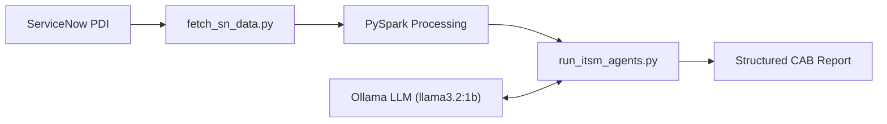

# ITSM AI Edge Agent

**Fully local, privacy-first AI agent for ServiceNow ITSM Change Management.**

An end-to-end offline system that extracts live Change Requests from ServiceNow, processes them using PySpark, and generates structured Change Advisory Board (CAB) risk assessments using a local Ollama LLM powered by CrewAI.

---

## ✨ Key Highlights

- **100% Local & Private** — No data leaves your machine
- **Live ServiceNow Integration** — Works with your Personal Developer Instance (PDI)
- **Hybrid Development** — Built using both **Agentic AI** (CrewAI + Ollama) and **GitHub Copilot**
- **Production Orchestrator** — One-command pipeline with full logging
- **Zero Cost** — Runs on commodity hardware

---

## Architecture


itsm-ai-edge-agent/
├── src/
│   ├── env_variables_setup.py
│   ├── fetch_sn_data.py
│   ├── read_pdi_servicenow_pyspark.py
│   ├── run_itsm_agentsV2.py
│   └── run_pipeline.py
├── V1/
│   └──run_itsm_agents.py
├── example/
│   └──snow.py
├── data/                    # JSON outputs
├── logs/                    # pipeline_execution.log
├── requirements.txt
├── README.md
├── getting_started.md
└── copilot_prompts.md
```
